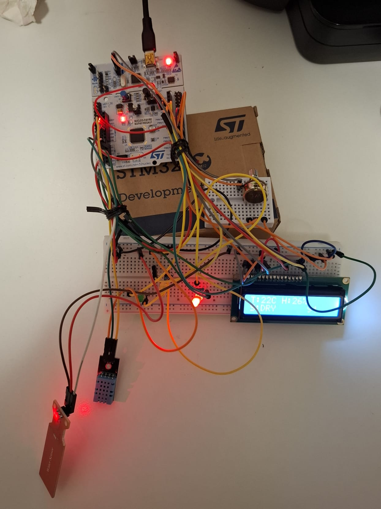
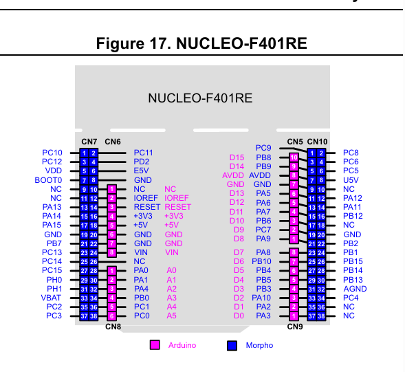
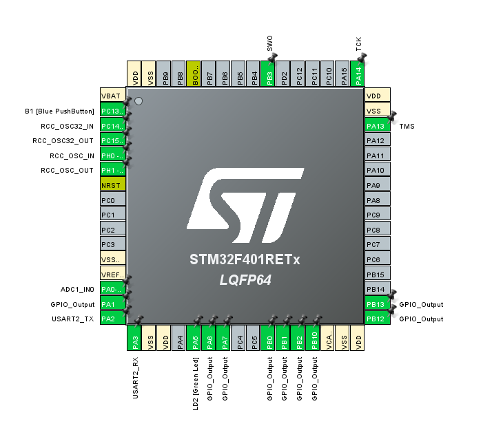
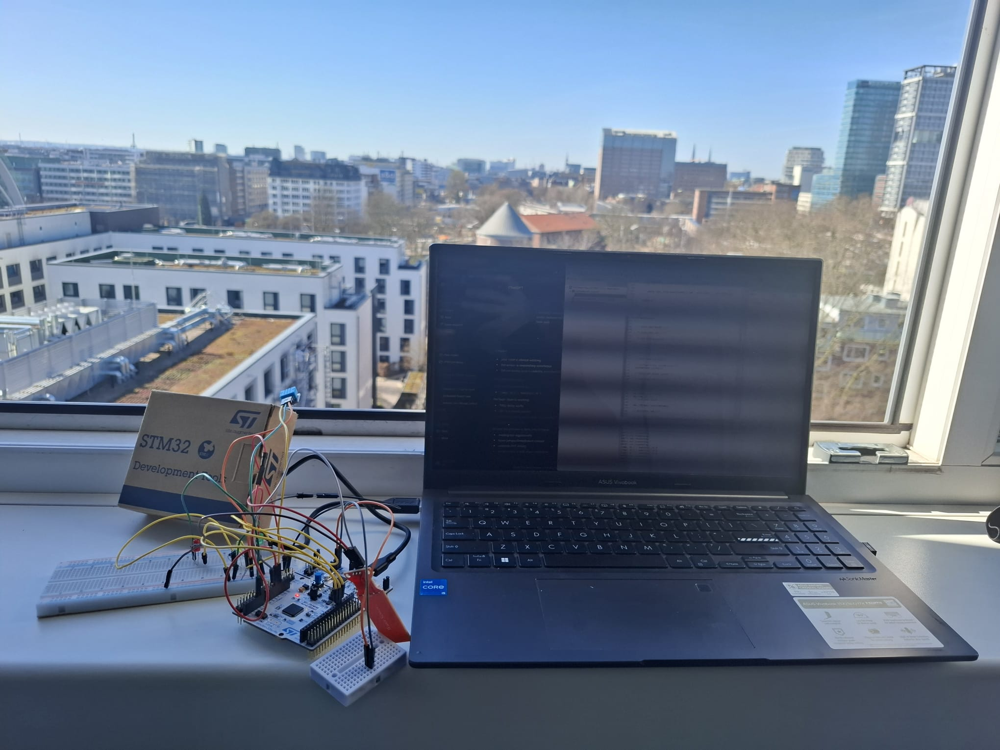
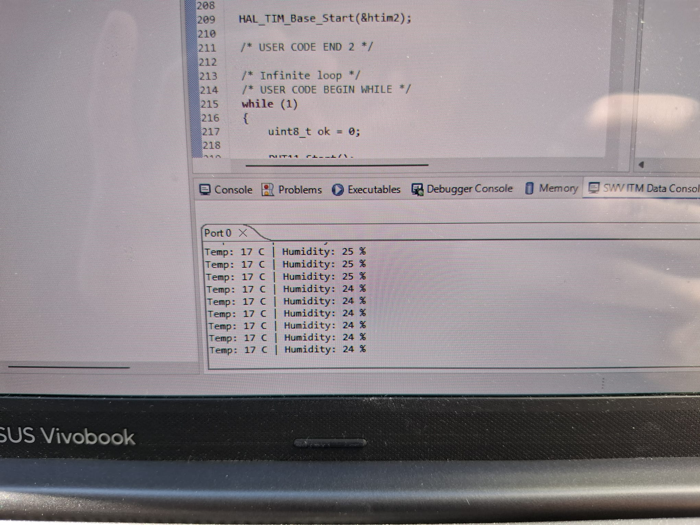
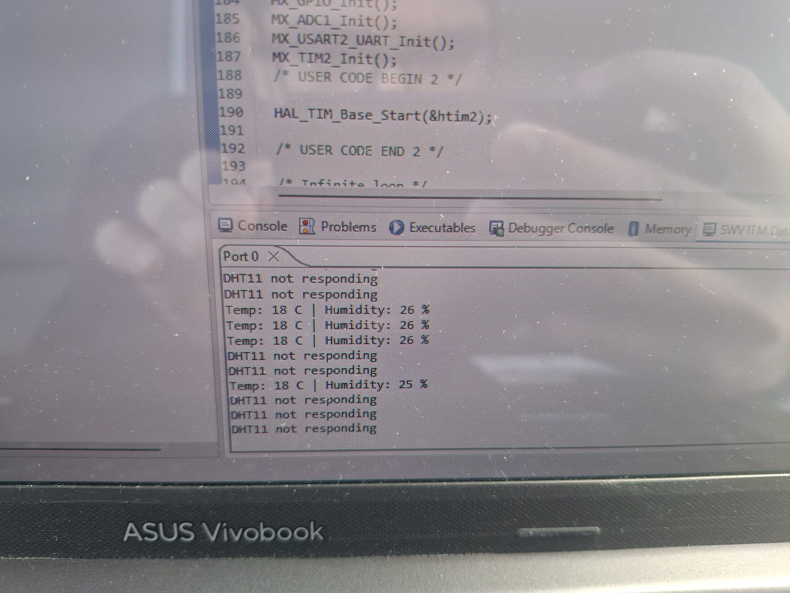

# STM32 Smart Soil Monitoring System

This repository features my work on a real-time embedded system built using the STM32 NUCLEO-F401RE. The system monitors soil conditions by measuring moisture, temperature, and humidity, and provides both visual and display-based feedback.

---

## System Overview

This project integrates multiple embedded subsystems into a single application to monitor and classify environmental conditions.

* **Analog signal acquisition:** Uses ADC for the soil moisture sensor.
* **Digital sensor communication:** Interfaces with a DHT11 for temperature and humidity.
* **LCD interfacing:** Drives a 16x2 LCD in 4-bit parallel mode using custom bare-metal logic (no external libraries).
* **GPIO indication:** Uses LEDs for quick visual status updates.
* **Real-time monitoring:** Runs a structured control loop to continuously read, classify, and display data.

  

---

## Hardware & Pin Configuration

  

The system was configured using STM32CubeMX, setting up the ADC, GPIO, UART, and hardware timers. 

| Component | STM32 Pin | Function |
| :--- | :--- | :--- |
| **Soil Sensor AO** | PA0 | ADC Input |
| **DHT11 Data** | PA1 | Digital I/O (TIM2 for microsecond delays) |
| **Green LED** | PA5 | WET indicator |
| **Yellow LED** | PA6 | MEDIUM indicator |
| **Red LED** | PA7 | DRY indicator |
| **LCD RS** | PB0 | Register Select |
| **LCD E** | PB1 | Enable Signal |
| **LCD D4** | PB2 | Data Line 4 |
| **LCD D5** | PB10 | Data Line 5 |
| **LCD D6** | PB12 | Data Line 6 |
| **LCD D7** | PB13 | Data Line 7 |

  

---

## System Logic

The soil moisture value is read using the ADC and classified using calibrated, empirically tested thresholds:

* **DRY (Red LED):** Moisture < 1500
* **MEDIUM (Yellow LED):** Moisture 1500 – 2200
* **WET (Green LED):** Moisture > 2200

The LCD continuously displays the real-time environmental data in the following format: `T:24C H:31% S:WET`

---

## Development Environment & Tools

* **IDE:** STM32CubeIDE
* **Configuration:** STM32CubeMX
* **Debugger:** ST-Link (SWV / ITM for serial debugging)
* **Language:** Embedded C using HAL drivers

  

  

---

## Challenges Overcome

**DHT11 Timing Instability:** The sensor frequently threw "not responding" errors due to the timing sensitivity of its protocol. I solved this by implementing a precise microsecond delay using hardware timer `TIM2` and adding robust timeout and retry logic.

  

**LCD Initialization:** The LCD initially showed only solid black boxes due to an incorrect initialization sequence. I resolved this by researching and implementing the correct 4-bit initialization sequence and fine-tuning the enable pulse delays.

**Pin Mapping Confusion:** Translating physical Arduino-style headers to STM32 pins (PAx/PBx) caused initial wiring issues. I used STM32CubeMX and board schematics to map everything accurately.

**ADC Calibration:** Raw moisture readings were inconsistent. I calibrated the sensor by testing it in ambient air, completely dry soil, and fully saturated soil to define reliable state thresholds.

---

## Learning Outcomes

Through this project, I developed practical, hands-on experience in:
* Embedded system design using the STM32 architecture.
* ADC calibration and digital sensor interfacing.
* Managing timing-critical communication protocols.
* Writing custom peripheral drivers (like the LCD) without relying on high-level Arduino libraries.
* Advanced debugging using the Serial Wire Viewer (SWV) and ITM data console.

---

## Future Roadmap

**Phase 2: IoT Extension (ESP32 Integration)**
* Add an ESP32-WROOM module via UART.
* Transmit telemetry data to a cloud dashboard and mobile application using MQTT/HTTP.

**Phase 3: Edge AI Integration**
* Replace simple threshold logic with predictive machine learning models.
* Use a secondary device (Raspberry Pi 2) to process historical data, predict soil dryness trends, and estimate optimal irrigation timing.

---

## Author

**Faizul Ahmed Robin** B.Sc. Information Engineering  
Hamburg University of Applied Sciences